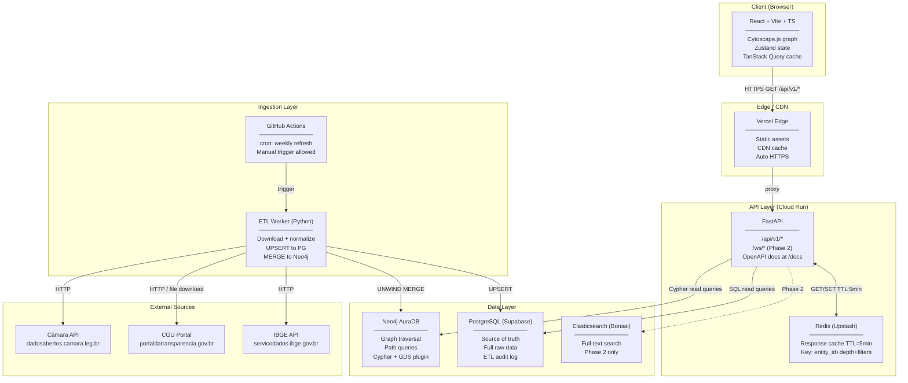
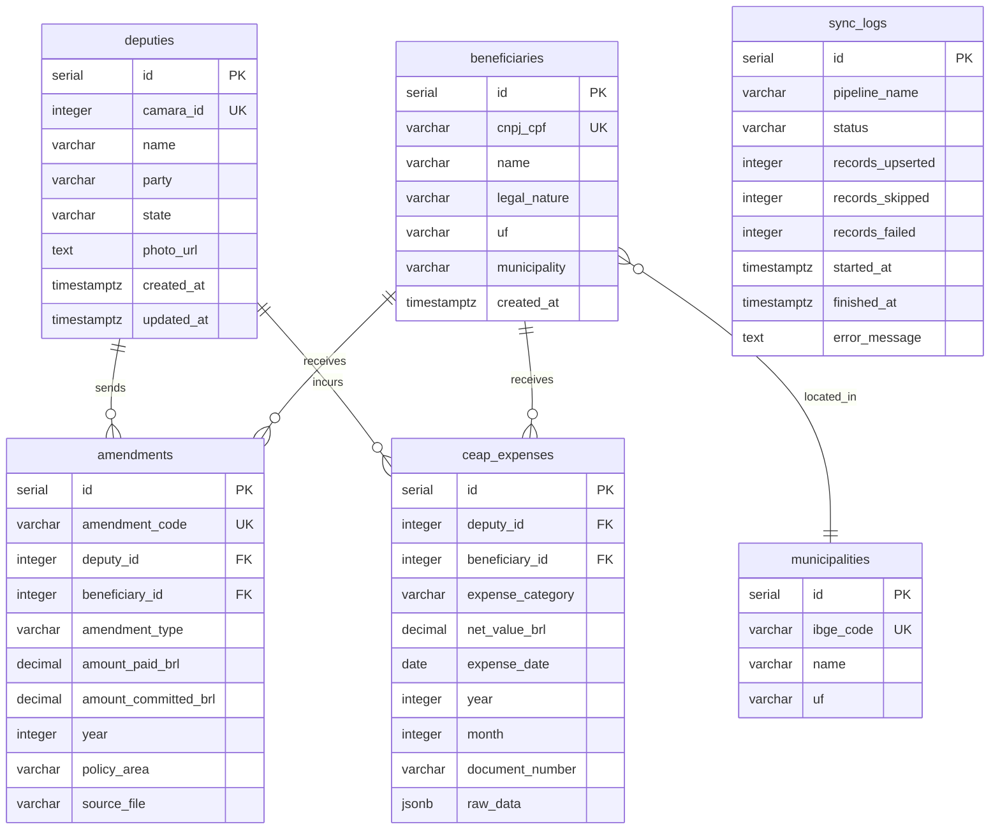
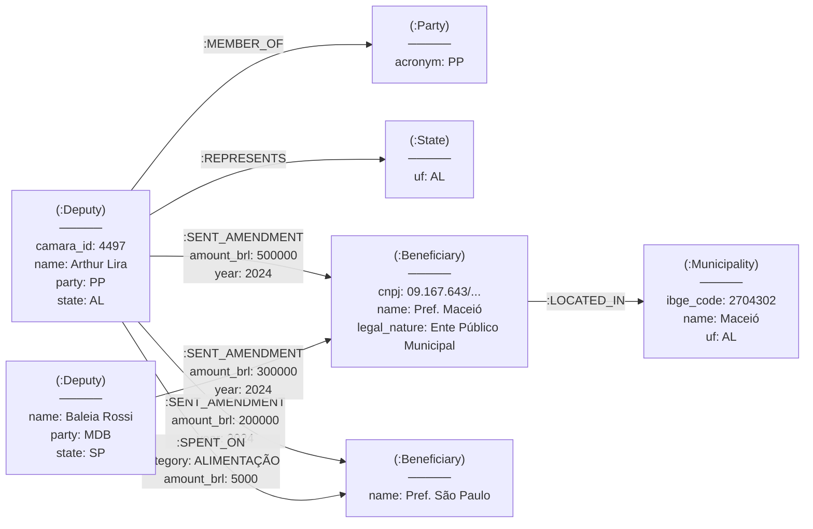
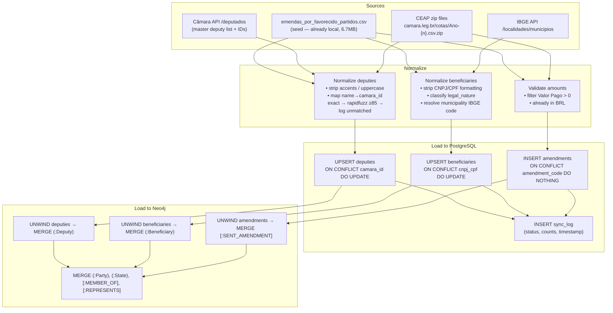
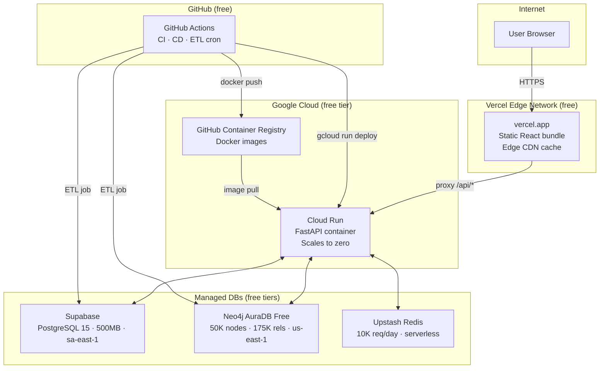
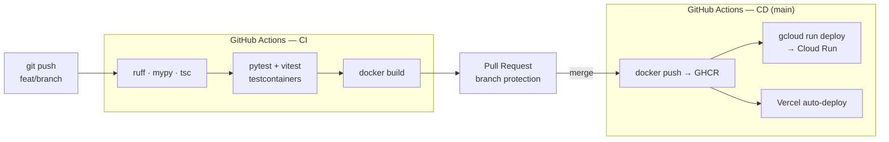
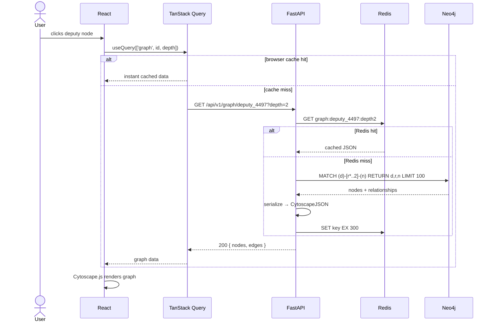
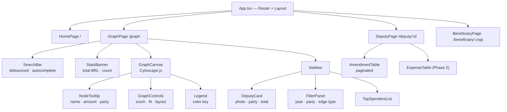
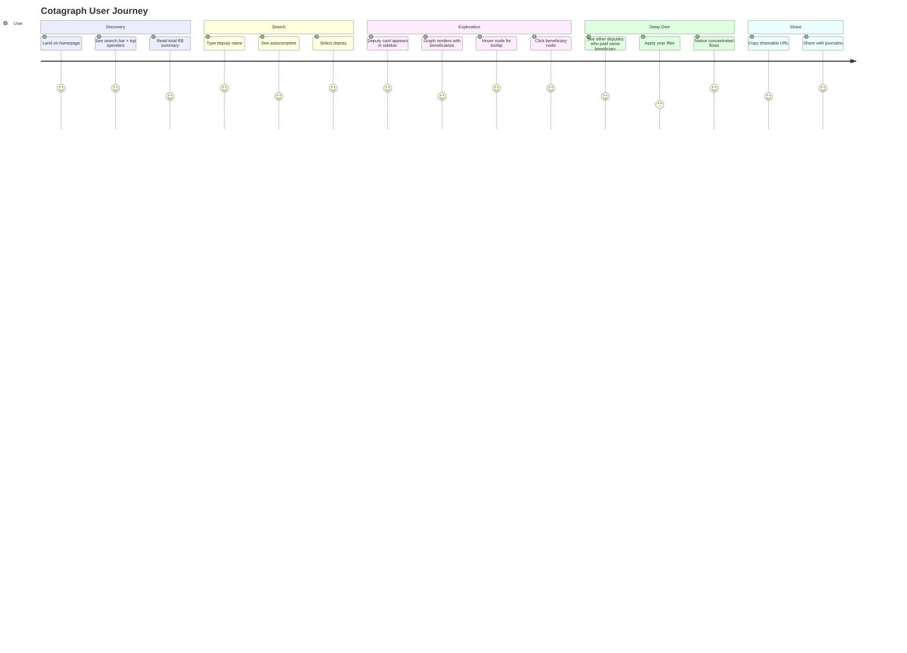

# System Diagrams — Cotagraph

All Mermaid diagrams in one place. Updated: 2026-04-07.

---

## 1. Logical Architecture (Component View)

---

## 2. PostgreSQL ERD (Source of Truth)

---

## 3. Neo4j Graph Model (Nodes and Edges)

---

## 4. ETL Data Flow (Ingestion Pipeline)

---

## 5. Deployment — Physical View (Production)

---

## 6. CI/CD Pipeline

---

## 7. Request Flow — Graph Query (Sequence)

---

## 8. Frontend Component Tree

---

## 9. User Journey

